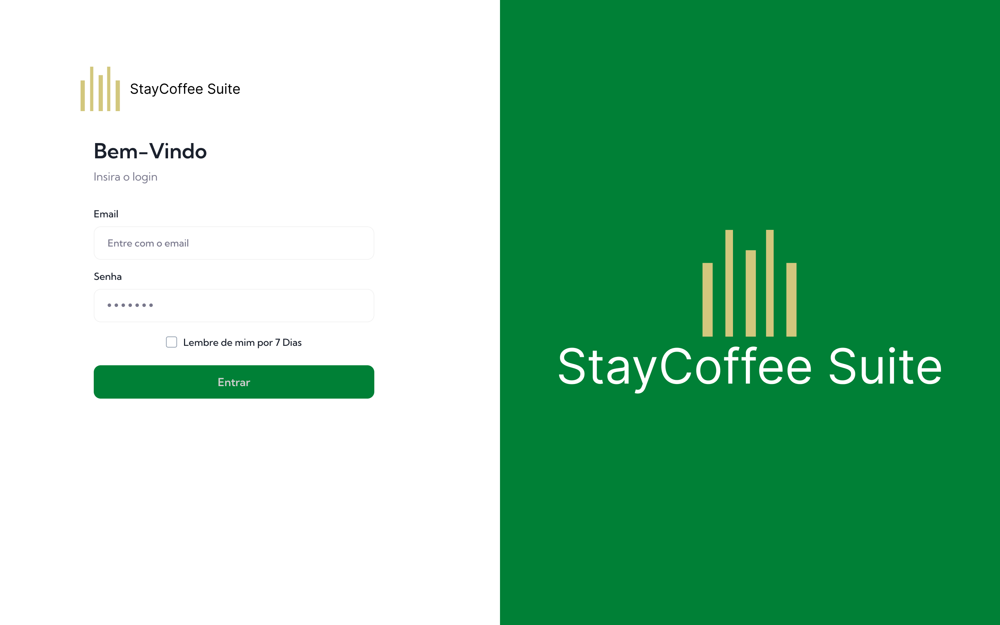
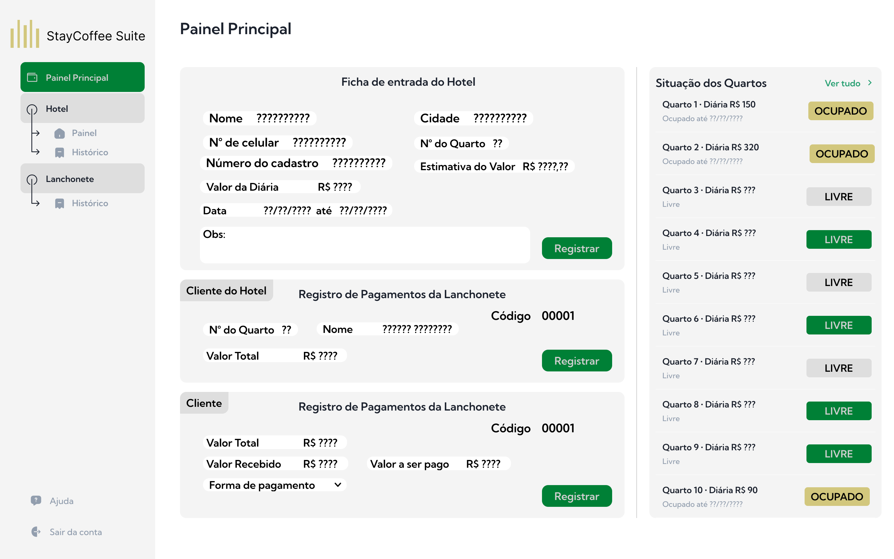

# StayCoffee Suite Fullstack APP

# Sistema de Gestão de Hotelaria

Hotelaria Management System

## Descrição

O Sistema de Gestão de Hotelaria é uma aplicação desenvolvida para atender às necessidades de uma corretora no gerenciamento de informações relacionadas a rede de hoteis. O sistema foi projetado para ser intuitivo, eficiente e fornecer uma experiência de usuário aprimorada.

## Tecnologias Utilizadas

- **Front-end:** ReactTs, Taiwaind, Ant-Design
- **Back-end:** Node.js, Express.js, PostgreSQL, TypeORM, Swagger

## Funcionalidades

- Registro de Quartos
- Registro de Entradas de Vendas na Lanchonete
- Balanço Geral

## Arquitetura

No contexto da arquitetura cliente-servidor do sistema de gestão, o front-end e o back-end são componentes essenciais que desempenham papéis distintos.

No front-end, a interface do usuário é desenvolvida utilizando tecnologias como ReactTs, Taiwaind e MaterialUI. Para facilitar a implantação e o gerenciamento do front-end, é comum utilizar o Docker para criar uma imagem e definir uma Dockerfile.

Essa Dockerfile utiliza uma imagem base do Node.js, copia os arquivos do projeto para o diretório de trabalho, instala as dependências, compila o código do front-end e define o comando de inicialização do servidor.

No back-end, a lógica de negócio, o processamento das requisições e o acesso ao banco de dados são implementados utilizando tecnologias como Node.js, Express.js, PostgreSQL, TypeORM. Assim como no front-end, é possível utilizar o Docker para criar uma imagem e definir uma Dockerfile para o back-end.

# Documentação da API

A API do Sistema de Gestão documentada utilizando o Swagger, uma ferramenta poderosa que permite descrever, visualizar e testar os endpoints da API de forma interativa. A documentação da API fornece informações detalhadas sobre os endpoints disponíveis, os parâmetros necessários, as respostas esperadas e exemplos de uso.

## Acesso à Documentação

Para acessar a documentação da API, siga os passos abaixo:

1. Certifique-se de que o sistema esteja em execução e a API esteja disponível.
2. Abra o navegador e digite o URL da API, seguido de "/docs". Por exemplo: `http://localhost:3000/docs`.
3. A página da documentação do Swagger será exibida, fornecendo uma visão geral dos endpoints e recursos disponíveis.

## Explorando a Documentação

A documentação da API é organizada de forma clara e intuitiva, permitindo que os desenvolvedores explorem facilmente os diferentes endpoints e recursos disponíveis. Cada endpoint é descrito em detalhes, incluindo:

- **Método HTTP:** O método HTTP utilizado pelo endpoint (GET, POST, PUT, DELETE, etc.).
- **Rota:** O caminho da URL que corresponde ao endpoint.
- **Descrição:** Uma breve descrição do objetivo e funcionalidade do endpoint.
- **Parâmetros:** Os parâmetros necessários para a chamada do endpoint, incluindo seus tipos, formatos e descrições.
- **Respostas:** As respostas esperadas do endpoint, incluindo códigos de status HTTP e exemplos de corpo de resposta.
- **Exemplos de Uso:** Exemplos de chamadas de API que demonstram como utilizar o endpoint corretamente.

Além disso, a documentação da API também pode incluir informações adicionais, como autenticação, autorização, limites de taxa e exemplos de fluxos de trabalho.

## Testando a API

Uma das vantagens do Swagger é a capacidade de testar os endpoints da API diretamente na documentação. Isso permite que os desenvolvedores executem chamadas de API e visualizem as respostas em tempo real, facilitando o processo de depuração e validação.

Para testar um endpoint na documentação, siga os passos abaixo:

1. Localize o endpoint desejado na documentação.
2. Clique no endpoint para expandir os detalhes.
3. Preencha os parâmetros necessários, se houver.
4. Clique no botão "Try it out" para executar a chamada de API.
5. A resposta da API será exibida na seção "Response", incluindo o código de status HTTP e o corpo da resposta.

## Testes Realizados

Durante o desenvolvimento do sistema, foram realizados os seguintes testes:

1. Testes Unitários:
   - Foram implementados testes unitários para cada componente e função crítica do sistema.
   - Os testes unitários foram escritos utilizando frameworks como Jest e Enzyme para garantir a corretude do código e a integridade das funcionalidades.

2. Testes de Integração:
   - Foram realizados testes de integração para verificar a interação correta entre os diferentes componentes do sistema.
   - Os testes de integração foram executados para garantir que as diferentes partes do sistema funcionem em conjunto de forma adequada.

3. Revisões de Código:
   - Foram realizadas revisões de código por pares para garantir a consistência e a qualidade do código.
   - Durante as revisões, foram identificados e corrigidos possíveis problemas, como código duplicado, má prática de programação e falta de comentários.

4. Análises Estáticas:
   - Foram utilizadas ferramentas de análise estática, como ESLint e Prettier, para garantir a consistência do código em termos de estilo e boas práticas de programação.
   - As análises estáticas ajudaram a identificar possíveis erros e melhorar a legibilidade e manutenibilidade do código.

## Resultados dos Testes

Os testes realizados no Sistema de Gestão de Café para Corretora apresentaram os seguintes resultados:

- Todos os testes unitários foram executados com sucesso, garantindo a corretude das funcionalidades implementadas.
- Os testes de integração demonstraram que as diferentes partes do sistema funcionam em conjunto de forma adequada.
- As revisões de código identificaram e corrigiram problemas, garantindo a consistência e a qualidade do código.
- As análises estáticas ajudaram a melhorar a legibilidade e a manutenibilidade do código, seguindo as melhores práticas de programação.

## Próximos Passos

Com base nos resultados dos testes de qualidade, os próximos passos para o Sistema de Gestão são:

1. Realizar testes de desempenho para garantir que o sistema possa lidar com uma carga de trabalho esperada.
2. Implementar testes de usabilidade para garantir uma experiência de usuário intuitiva e eficiente.
3. Continuar realizando revisões de código e análises estáticas para manter a qualidade do código ao longo do tempo.
4. Monitorar e corrigir possíveis bugs e problemas identificados pelos usuários durante o uso do sistema.

## Colaboração e Comunicação

Durante a minha experiência como gerente do projeto de desenvolvimento do sistema de gestão, aprendi a importância de uma comunicação eficiente com a equipe. Realizamos reuniões regulares para discutir o andamento do projeto, compartilhar conhecimentos e alinhar as expectativas.

A colaboração foi um fator chave para o sucesso do projeto. Estabelecemos um ambiente de trabalho colaborativo, onde todos os membros da equipe se sentiam à vontade para compartilhar ideias, propor soluções e trabalhar juntos em direção aos mesmos objetivos. Essa colaboração nos permitiu aproveitar a experiência e conhecimento de cada membro da equipe, resultando em um sistema de alta qualidade.

Além das reuniões, utilizamos ferramentas de comunicação online para manter uma comunicação constante. Isso nos permitiu resolver problemas de forma ágil, compartilhar atualizações e garantir que todos estivessem cientes das mudanças e progresso do projeto.

Acredito que a comunicação eficiente e a colaboração foram fundamentais para o sucesso do projeto. Elas nos permitiram superar desafios, manter o projeto dentro do prazo e entregar um sistema de gestão de café para corretora que atendesse às expectativas dos usuários.

Estou orgulhoso da equipe e da forma como trabalhamos juntos para alcançar nossos objetivos. Aprendi muito durante esse projeto e continuo valorizando a importância da comunicação e colaboração em todos os projetos que gerencio.

## Como Contribuir

1. Faça um fork deste repositório.
2. Crie uma branch para sua nova feature: `git checkout -b minha-nova-feature`.
3. Faça as alterações necessárias e adicione os commits: `git commit -m "Minha nova feature"`.
4. Envie suas alterações para o repositório remoto: `git push origin minha-nova-feature`.
5. Abra um pull request descrevendo suas alterações.

## Garantia de Qualidade

Antes de disponibilizar o sistema para uso, é realizada uma fase de testes rigorosa para garantir que o software esteja livre de bugs e erros. Além disso, são implementadas práticas de garantia de qualidade, como revisões de código, testes de desempenho e testes de usabilidade, para garantir que o sistema atenda às expectativas dos usuários.

## Licença

Este projeto está licenciado sob a [MIT License](https://opensource.org/licenses/MIT).
